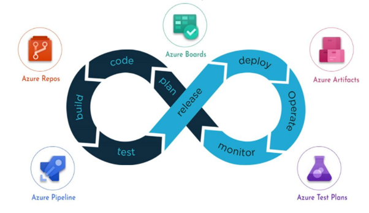
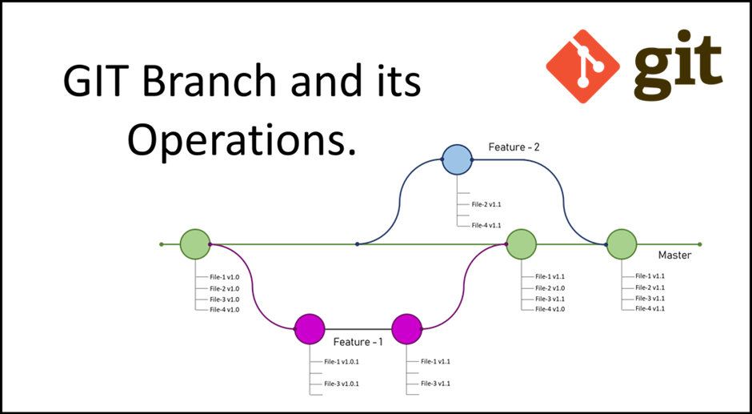

### What this Module covers
- Introduction to DevOps and DevOps tools
- Version Control as a DevOps tools
- Git Repositories

**What is DevOps**

DevOps is the union of people, process, and technology to continually provide value to customers - Donovan Brown

**Why DevOps?**

Traditionally, development and operations teams worked in silos:

- **Developers** wrote code and handed it off to operations.
- **Operations** deployed and maintained the software.

This often led to **delays, miscommunication, and software failures** due to a lack of coordination. DevOps bridges this gap by ensuring **seamless collaboration, faster releases, and higher efficiency**

**What does DevOps mean for teams?**

DevOps enables formerly siloed roles—development, IT operations, quality engineering, and security—to coordinate and collaborate to produce better, more reliable products.

**DevOps Processes and Tools**

To enable easier collaboration among DevOps teams and ensure the continuous delivery of value to customers, certain key practices need to be followed. Each process is supported by a range of tools that help achieve specific tasks. Below is an outline of the key DevOps processes and the tools that assist in these stages:

1.  **Version Control**  
    The process of managing and tracking changes to source code.

    **Tools**: GitHub || Azure Repos ||GitLab || Bitbucket

2.  **Continuous Integration (CI)**  
    Automatically building and testing code whenever changes are made to ensure that new code integrates smoothly with the existing codebase.

    **Tools**: Azure Pipelines || GitHub Actions || Jenkins

3.  **Continuous Delivery (CD)**  
    Automating the deployment process so that code can be deployed to production (or staging) environments quickly and reliably.

    **Tools**: Azure Pipelines || GitHub Actions || Jenkins

4.  **Infrastructure as Code (IaC)**  
    Managing infrastructure (servers, databases, networking) through code, allowing teams to provision, configure, and manage infrastructure resources programmatically.

    **Tools**: Terraform || Azure Resource Manager (ARM) || Bicep

5.  **Containerization and Orchestration**  
    Packaging applications and their dependencies into lightweight containers and using orchestration tools to manage and scale these containers.

	**Tools**: Docker || Kubernetes || Azure Kubernetes Service (AKS)

6.  **Monitoring and Logging**  
    Continuously monitoring application performance, tracking logs, and ensuring that systems are functioning as expected in production.

	**Tools**: Prometheus || Grafana || Azure Monitor ||Splunk

7.  **Testing (Continuous Testing)**  
    Automating the testing process to ensure that new code does not introduce bugs and that the application meets the required quality standards.

	**Tools**: Selenium (for UI testing) || JUnit (for unit testing ) ||  SonarQube (for static code analysis)

8. **Security (DevSecOps)**  
    Integrating security into every stage of the DevOps pipeline to ensure applications and infrastructure are secure.

	**Tools:** OWASP ZAP || Snyk || Twislock

9.  **Collaboration and Communication**  
    Promoting better collaboration and communication across teams (development, operations, security, etc.) to ensure faster feedback and smoother workflow.

	**Tools**: Slack || Teams || Jira || Confluence || Azure Boards

Each of these processes plays a vital role in ensuring a smooth, efficient, and automated DevOps pipeline. By integrating the right tools at every stage of the software development lifecycle, DevOps teams can continuously deliver value, respond to issues faster, improve security, and create a culture of collaboration and continuous improvement.

**DevOps Vs Azure DevOps**

**DevOps** - is a **culture, set of practices, and principles** that aims to bridge the gap between development (Dev) and operations (Ops) teams

**Azure DevOps** - is a **cloud-based set of development tools** provided by **Microsoft** to help teams implement DevOps practices. It is a platform for managing the entire software development lifecycle, offering a range of services to help teams plan, build, test, and deploy software more efficiently.

To learn more about Azure DevOps - [What is Azure DevOps? - Azure DevOps | Microsoft Learn](https://learn.microsoft.com/en-us/azure/devops/user-guide/what-is-azure-devops?view=azure-devops)

Follow this link on how to create an Azure DevOps project: [Create a project - Azure DevOps | Microsoft Learn](https://learn.microsoft.com/en-us/azure/devops/organizations/projects/create-project?view=azure-devops&tabs=browser)

### Version Control

**Version Control** is a system that allows you to manage changes to code or other files over time. It helps developers track and manage changes in a collaborative manner, ensuring that they can work together without overwriting each other's work, roll back to previous versions of files, and maintain a clear history of changes made to a project.

**Key Concepts of Version Control**

1.  **Versioning**:

-   **Version control** enables you to keep track of different versions of files, so you can view the history of changes made to your code or documents over time.
-   Each change to the codebase is saved as a "commit", and each commit is associated with metadata (e.g., author, timestamp, message).

3.  **Repositories**:

-   A **repository** (or "repo") is a place where all the versions of the project's files are stored. Repositories can either be stored locally (on your computer) or remotely (on a server like GitHub, GitLab, or Azure DevOps).
-   Repositories track the changes and provide a history of the entire project, enabling developers to see who made what changes and when.

5.  **Branches**:

-   A **branch** is essentially a separate line of development. Branches allow developers to work on different features or fixes in parallel without interfering with each other’s work.
-   In a typical workflow, developers create a branch, make changes, test them, and then merge those changes back into the main branch (e.g., main or master).
-   Branching allows developers to isolate their changes, experiment without fear of breaking the main project, and work on multiple features simultaneously.

7.  **Commits**:

-   A **commit** is a snapshot of the changes made to files at a particular point in time. Every time a developer makes changes to the code and saves those changes in the version control system, a commit is created.
-   Each commit contains:

-   **A snapshot** of changes made to files.
-   **A commit message** describing the change.
-   **Metadata** such as the commit author, timestamp, and ID (e.g., a hash in Git).

9.  **Merging**:

-   **Merging** is the process of combining the changes from one branch into another. For example, after working on a feature in a separate branch, you would merge it back into the main branch.
-   Sometimes, merging causes **conflicts** if two people have edited the same part of the code differently, and these need to be resolved manually.

11.  **Remote Repositories**:

-   A **remote repository** is a version of the repository that is hosted on a server, allowing multiple developers to access and collaborate on it. Examples of remote repositories include **GitHub**, **GitLab**, **Azure Repos**, and **Bitbucket**.
-   Developers can **clone** a remote repository to get a copy of it locally, **push** their changes back to the remote server, and **pull** changes from others into their own local copy.

13.  **Pull Requests (PRs)**:

-   In many version control systems (e.g., GitHub, GitLab, Azure DevOps), developers use **Pull Requests** (or **Merge Requests**) to propose changes made in one branch to be merged into another branch.
-   PRs allow team members to review code, discuss changes, and ensure that the code meets quality standards before merging it into the main or master branch of the project.

Two of the major version Control tools available is **Github** and **Azure** Repos. You can choose to use either one. Based on your choice, here is link with  a step by step guide on how to create:

- Create **Github** account [Creating an account on GitHub - GitHub Docs](https://docs.github.com/en/get-started/start-your-journey/creating-an-account-on-github) and **Github Repository** [Quickstart for repositories - GitHub Docs](https://docs.github.com/en/repositories/creating-and-managing-repositories/quickstart-for-repositories)

- Create **Azure DevOps Repository**  [Create a new Git repo in your project - Azure Repos | Microsoft Learn](https://learn.microsoft.com/en-us/azure/devops/repos/git/create-new-repo?view=azure-devops)

