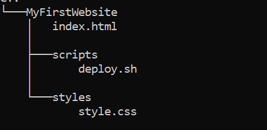
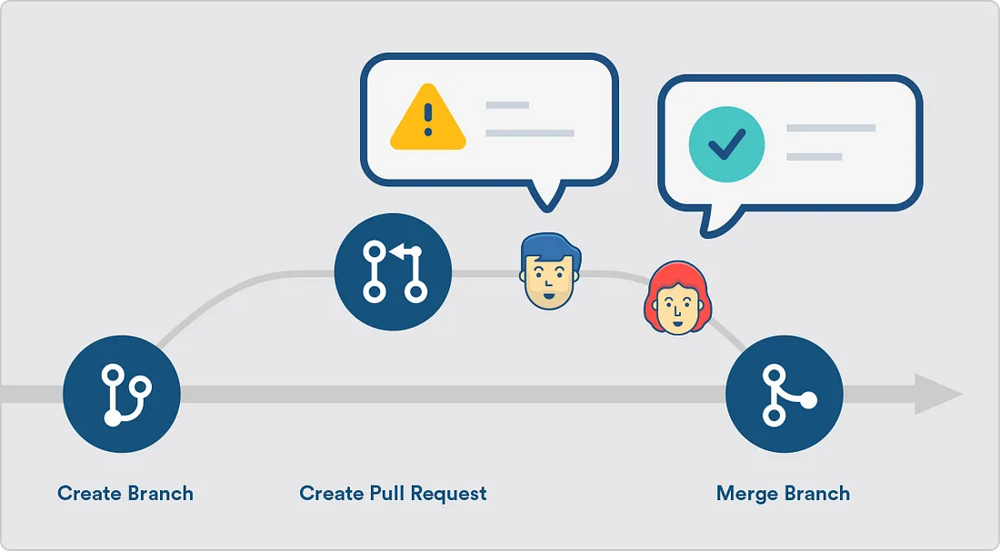
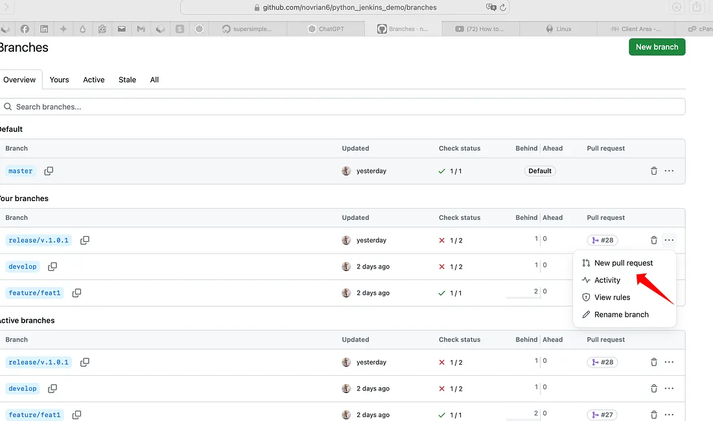

### What this Module covers
- Introduction to Git
- Basic Git commands
- Creating Git branch and pull request

## Introduction to Git: Pushing Code, Branching, and Pull Requests

Version control is an essential part of modern software development, and Git is one of the most widely used tools for managing code changes. Pushing code to a repository allows developers to store their work securely, collaborate with others, and track changes effectively.

**Basic Git Commands**

-   **git init** – Create a new repository.
-   **git clone** – Clone an existing repository.
-   **git add** – Stage files for commit.
-   **git commit** – Commit changes.
-   **git status** – Check the status of your repository.
-   **git log** – View commit history.

**Working with Branches**

-   **git branch** – List, create, or delete branches.
-   **git checkout** – Switch between branches.
-   **git merge** – Merge changes from one branch into another.
-   **git rebase** – Rebase branches (a more advanced operation).

**Syncing with Remote Repositories**

-   **git push** – Push changes to a remote repository.
-   **git pull** – Pull the latest changes from a remote repository.
-   **git fetch** – Retrieve changes without merging.

## Using Git locally

Follow the instructions here to install Git: [Git - Installing Git](https://git-scm.com/book/en/v2/Getting-Started-Installing-Git). We will be working with Git using the command line only, as it provides a simpler way to learn Git.

Once Git is installed, we will use it to track a basic project—a static HTML website containing the following files:



1. Create a directory for your project and add your files to it

```bash
mkdir MyFirstWebsite # Creating a directory
cd MyFirstWebsite # changing directory
```

2. Configure git to set your name, and email address to be associated with commit

```bash
git config --global user.name <Your Name Here>
git config --global user.email <youremail@capgemini.com>
```

3. Initialize Git in your project

```bash
git init
```

4. Connect to a Remote Repository (**GitHub/Azure Repos**):

```bash
git remote add origin <repository-url>
```

5. Stage and Commit Your Changes
```bash
git add .
git commit -m "Initial commit"
```

6. Push Your Code to the Remote Repository:
```bash
git push origin main
```

7. Verify the Push:  
    Go to the GitHub/Azure Repos repository to confirm that your files are uploaded.

## Working with Branches and Pull Requests (PR)


Branches allow developers to work on features independently without affecting the main codebase. Once the changes are complete, they can be merged into the main branch through a Pull Request (PR).

**Creating and Switching Branches**

1.  Create a New Branch:

```bash
git branch feature-branch
```

2.  Switch to the New Branch:
```bash
git checkout feature-branch
```

3.  Make Changes and Commit:

```bash
git add .
git commit -m "Added a new feature"
```

**Opening a Pull Request (PR)**

Once changes are committed to the feature branch, you can open a PR:

1.  Push the Branch to Remote Repository:

```bash
    git push origin feature-branch
```

2.  Go to GitHub/Azure Repos and Navigate to the Repository.
3.  Click "New Pull Request" and Select the Branch.
    

4.  Review Changes and Request Feedback.
5.  Merge the PR Once Approved.
6.  Delete the Feature Branch (Optional):

```bash
     git branch -d feature-branch
```


