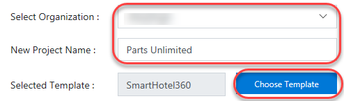
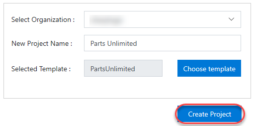
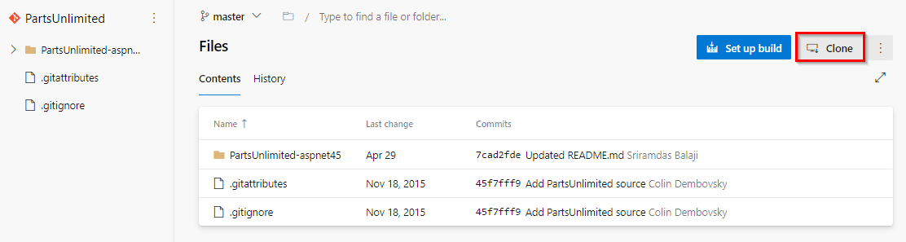
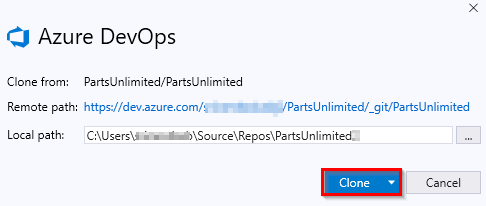
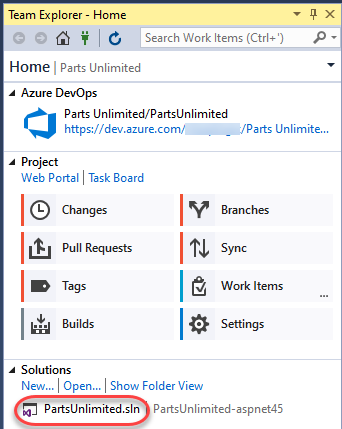

# Overview #
Certain Azure DevOps labs require a preconfigured **Parts Unlimited** team project. This document outlines the required steps to set up the required data.

### Task 1: Configuring the Parts Unlimited team project ###

1. Navigate to [https://azuredevopsdemogenerator.azurewebsites.net](https://azuredevopsdemogenerator.azurewebsites.net/). This utility site will automate the process of creating a new Azure DevOps project within your account that is prepopulated with content (work items, repos, etc.) required for the lab. For more information on the site, please see [https://docs.microsoft.com/en-us/azure/devops/demo-gen](https://docs.microsoft.com/en-us/azure/devops/demo-gen).

1. Sign in using the Microsoft account associated with your Azure DevOps subscription.

    

1. **Accept** the permission requests for accessing your subscription.

1. Select your Azure DevOps organization and enter the project name **"Parts Unlimited"**. Click **Choose Template**.

    

1. Select the **PartsUnlimited** template and click **Select Template**.

    

1. Click **Create Project** and wait for the process to complete.

    

### Task 2: Configuring the Parts Unlimited solution in Visual Studio ###

1. Some labs will require you to open the **Parts Unlimited** solution in **Visual Studio**. If your lab doesn't require this, you can skip this task.

1. Navigate to your Azure DevOps team project for **Parts Unlimited**. It will be something like [https://dev.azure.com/YOURACCOUNT/Parts%20Unlimited](https://dev.azure.com/YOURACCOUNT/Parts Unlimited).

1. Navigate to the **Repos** hub.

    

1. Click **Clone** and select **Clone in Visual Studio** (choose it in the dropdown if other option shown as default).
    
    

1. Follow the workflow to clone and configure the project in Visual Studio. Click **Clone** to copy the repo locally.

    

1. From **Team Explorer**, double-click **PartsUnlimited.sln** from the **Solutions** section to open the solution. You can ignore if you see any warnings about unsupported project types (just click OK on the prompted window and ignore the migration report opened on the browser)

    

    

1. Leave Visual Studio open for use in your lab.

## Navigation:
[Readme](./readme.md) |
[Setup](./set-up.md) |
[Exercise](./exercise.md)