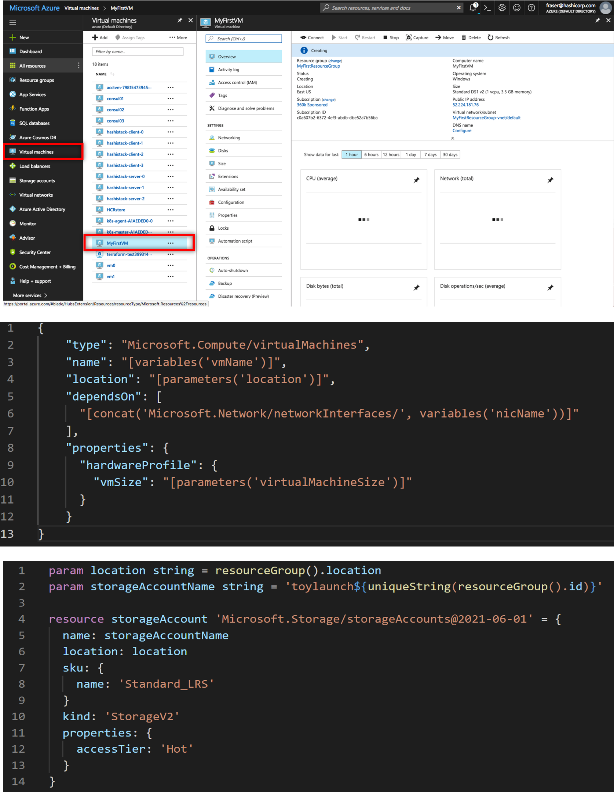
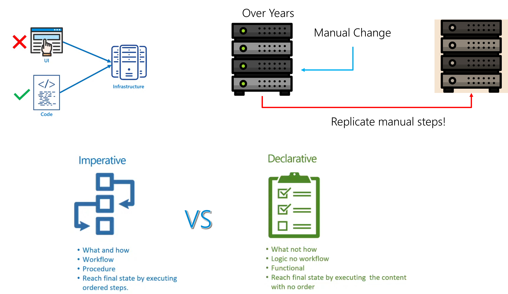
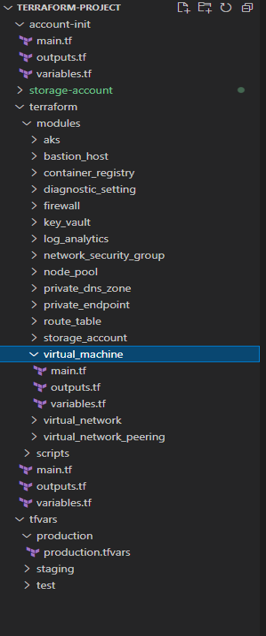
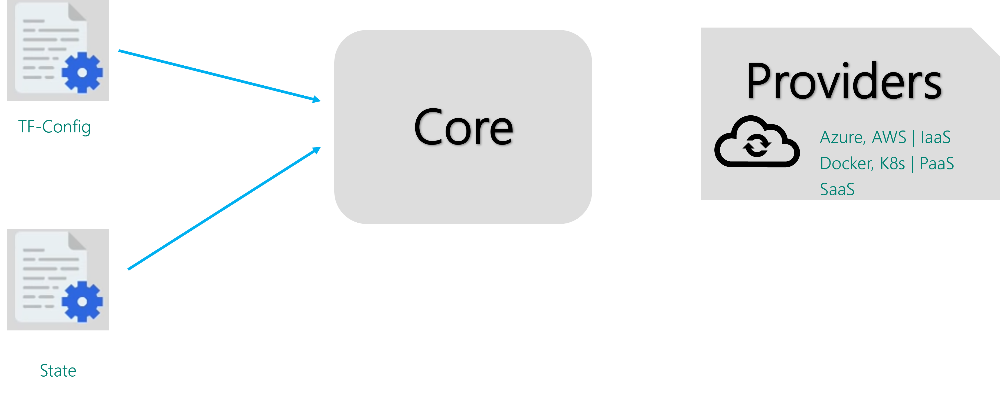
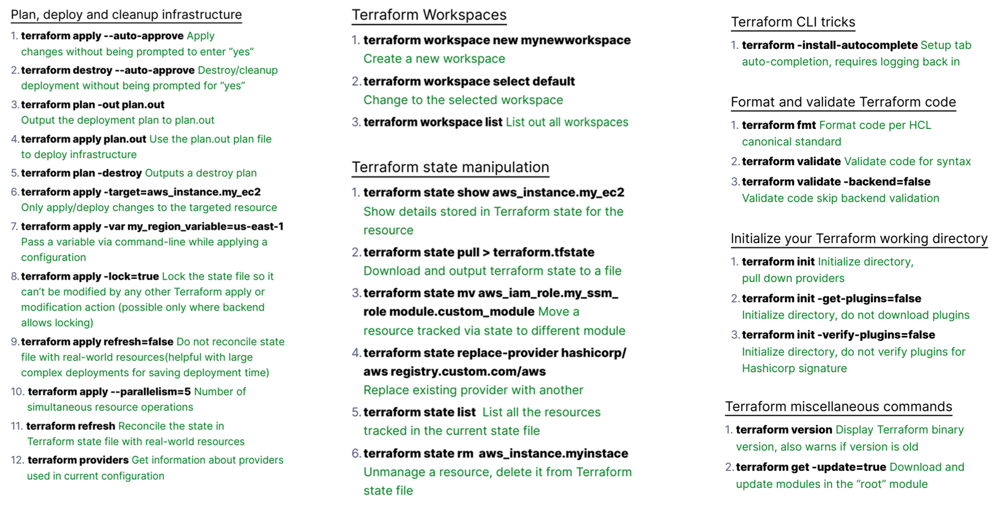

# Introduction to IaC
## Why "Infrastructure as Code"

"Infrastructure as Code" (IaC) is a pivotal practice for managing large-scale, distributed systems, cloud-native applications, and service-based architectures. By defining infrastructure configurations in code, IaC enables automation, consistency, and scalability in infrastructure management. Here are the key reasons why IaC is essential:

1. **Automation**: IaC allows for the automation of infrastructure provisioning and management, reducing the need for manual intervention and minimizing human error.
2. **Consistency**: By using code to define infrastructure, you ensure that environments are consistent across development, testing, and production, eliminating discrepancies and configuration drift.
3. **Scalability**: IaC makes it easier to scale infrastructure up or down based on demand, enabling efficient resource utilization and cost management.
4. **Version Control**: Infrastructure configurations can be versioned and stored in version control systems, providing a history of changes and facilitating collaboration among team members.
5. **Reusability**: Code modules and templates can be reused across different projects and environments, promoting efficiency and reducing duplication.
6. **Compliance and Auditability**: IaC provides a clear and auditable trail of infrastructure changes, helping organizations meet compliance requirements and maintain security standards.

By adopting IaC, organizations can achieve greater agility, reliability, and efficiency in managing their infrastructure, ultimately supporting the rapid delivery of high-quality software and services.



Infrastructure as code is a mainstream pattern for managing infrastructure with configuration files rather than through a graphical user interface or through manual command line script sequences. It allows you to build, change, and manage your infrastructure in a safe, consistent, trackable, and repeatable way by defining resource configurations that you can version (in a version control system like GitHub), reuse, and share.

Terraform is the most commonly used infrastructure as code provisioning engine.

## Version Control for Infrastructure
Version control is a critical aspect of managing Infrastructure as Code (IaC). It allows teams to track changes, collaborate effectively, and maintain a history of infrastructure configurations. Here are some key points:

Tracking Changes: Version control systems (VCS) like Git enable you to track changes to your IaC scripts. Each change is recorded with a commit message, making it easy to understand what was modified and why.
Collaboration: Multiple team members can work on the same infrastructure codebase simultaneously. VCS tools support branching and merging, allowing for parallel development and integration of changes.
Rollback and Recovery: If a change introduces an issue, you can easily revert to a previous stable state. This is crucial for maintaining the reliability and stability of your infrastructure.
Audit and Compliance: Version control provides a detailed history of changes, which is useful for auditing and ensuring compliance with organizational policies and industry regulations.
Continuous Integration/Continuous Deployment (CI/CD): Integrating IaC with CI/CD pipelines ensures that infrastructure changes are tested and deployed automatically, reducing the risk of human error and speeding up the deployment process.


## Reusability and Modularity in IaC
Reusability and modularity are essential principles in IaC that promote efficiency, consistency, and maintainability. Here’s how they can be applied:

Modules: In tools like Terraform, modules are reusable components that encapsulate a set of resources. By defining modules, you can create standardized infrastructure components that can be reused across different projects.
Example: A module for creating an AWS VPC can be reused in multiple environments (development, staging, production) with different configurations.
Parameterization: Use variables to parameterize your IaC scripts. This allows you to customize the behavior of your modules without modifying the underlying code.
Example: A module for deploying a web server can accept parameters for instance type, AMI ID, and security group settings.
DRY Principle (Don't Repeat Yourself): Avoid duplicating code by abstracting common patterns into modules or functions. This reduces the risk of errors and makes your codebase easier to maintain.
Composition: Combine smaller modules to build more complex infrastructure. This approach allows you to manage and understand your infrastructure in a hierarchical manner.
Example: A module for a web application might include sub-modules for networking, compute instances, and databases.
Versioning Modules: Just like application code, version your modules to manage changes and ensure compatibility. This helps in maintaining consistency across different environments and projects.
By leveraging version control and focusing on reusability and modularity, you can create robust, scalable, and maintainable infrastructure using IaC.

# Key Concepts of IaC
## Declarative vs. imperative approaches.
There are 2 ways to approach IaC: declarative or imperative. 

A declarative approach defines the desired state of the system, including what resources you need and any properties they should have, and an IaC tool will configure it for you. 

A declarative approach also keeps a list of the current state of your system objects, which makes taking down the infrastructure simpler to manage.

An imperative approach instead defines the specific commands needed to achieve the desired configuration, and those commands then need to be executed in the correct order. 

Many IaC tools use a declarative approach and will automatically provision the desired infrastructure. If you make changes to the desired state, a declarative IaC tool will apply those changes for you. An imperative tool will require you to figure out how those changes should be applied.

IaC tools are often able to operate in both approaches, but tend to prefer one approach over the other.





Example with Ansible (imperative approach):
``` yaml
- name: Install and Manage Apache
  hosts: webservers
  tasks:
    - name: Ensure Apache is installed
      yum:
        name: httpd
        state: present
    - name: Ensure Apache service is running
      service:
        name: httpd
        state: started
```

Example with Terraform (declarative approach):
``` hcl
resource "aws_instance" "web" {
  ami           = "ami-0c94855ba95c574c8"
  instance_type = "t2.micro"

  vpc_security_group_ids = [aws_security_group.allow_http.id]

  tags = {
    Name = "WebServer"
  }
}

resource "aws_security_group" "allow_http" {
  name        = "allow_http"
  description = "Allow inbound traffic on port 80"

  ingress {
    from_port   = 80
    to_port     = 80
    protocol    = "tcp"
    cidr_blocks = ["0.0.0.0/0"]
  }
}
```

[Infrastructure as Code (IaC): Comparing the Tools](https://techcommunity.microsoft.com/blog/itopstalkblog/infrastructure-as-code-iac-comparing-the-tools/3205045)

## Version control for infrastructure.
When you define your infrastructure as code, you can use version control tools to store your infrastructure code. That gains you a lot of advantages.


#### The Evolution of Version Control

Version control systems (VCS) have evolved significantly since their inception in the 1980s. Early tools like RCS were used by programmers to track changes to their code. Today, modern systems like Git enable multiple users, often in different locations, to collaborate on the same codebase. These tools are now also used to manage infrastructure code, providing several advantages that application developers have enjoyed for years.

#### Advantages of Version Control for IaC

1. **Audit Trail and Consistency**
   - **Audit Trail**: Version control provides a detailed history of every change made to your infrastructure. This ensures that you have a clear record of what was modified, when, and by whom.
   - **Consistency**: By storing all infrastructure instructions in a version-controlled repository, you ensure that infrastructure is built consistently every time. This eliminates the variability and errors associated with manual configurations.

2. **Testing and Automation**
   - **Automated Testing**: Infrastructure code can be tested using automated pipelines. These pipelines can stand up your infrastructure and run tests against it without human intervention. This helps catch errors before they reach production, reducing the risk of deployment failures.
   - **Continuous Integration/Continuous Deployment (CI/CD)**: Integrating IaC with CI/CD pipelines ensures that changes are automatically tested and deployed, enhancing reliability and speed.

3. **Promotion of Changes**
   - **Environment Consistency**: Version control helps ensure that development, staging, and production environments are identical. This reduces the risk of deployment issues that arise from environment discrepancies.
   - **Seamless Promotion**: Changes can be promoted from development to staging to production in a controlled and predictable manner. This minimizes the risk of errors and ensures smooth deployments.

#### Additional Benefits

- **Speed**: Using version control for IaC allows for faster deployments and updates. Changes can be made, reviewed, and deployed quickly, enhancing overall productivity.
- **Reduced Risk**: With a clear record of changes, you can avoid unexpected modifications that might introduce vulnerabilities or other issues.
- **Efficiency**: Fewer failed deployments mean that your operations team can focus on delivering new features and improvements rather than troubleshooting issues during late-night maintenance windows.

By leveraging version control for your IaC scripts, you can enhance collaboration, ensure stability, and maintain a comprehensive history of your infrastructure configurations. This practice is essential for managing complex cloud environments and ensuring that your infrastructure is both reliable and scalable

## Reusability and modularity in IaC.


One of the key benefits of IaC is the ability to reuse code and templates across different projects and environments. Adopt a modular approach by breaking down your infrastructure into smaller, reusable components. For example, you could create modules for common infrastructure patterns such as virtual networks, subnets, and security groups. This allows you to abstract common configurations into modules that can be easily shared and reused across multiple projects, reducing duplication and simplifying maintenance.

Modular design is essential for managing complexity and promoting code reuse. By organizing configurations into modules, teams can simplify maintenance, version control, and scalability. 

Modular IaC allows for isolated testing and versioning of configurations, making it easier to implement changes in specific parts of the infrastructure without impacting others. 

For example, separate modules can be created for VPCs, security groups, and databases, which can then be reused across multiple environments.

Example: Modular Setup in Terraform




[Microsoft Recommendations for using infrastructure as code](https://learn.microsoft.com/en-us/azure/well-architected/operational-excellence/infrastructure-as-code-design)
# How Terraform works
To do its job, Terraform core uses two input sources. The first is the source input that the user configures into Terraform, defining what resources need to be created or provisioned. The second input source consists of data feeds into Terraform about what the current infrastructure setup looks like.


Terraform then takes these inputs and determines what actions need to be taken. It takes the user-specified desired state, compares it with the current state, and configures the architecture in a way that closes the gaps. Terraform Core essentially figures out what needs to be created, updated, or deleted in order to fully provision your infrastructure.


## Initialize the Terraform repo


## Terraform Commands cheat sheet


## Run Terraform plan


## Run Terraform apply


## Let's implement this using Azure DevOps


### You can use the below Azure cli commands to set the terraform remote backend

``` shell
#!/bin/bash
## The Storage account name must be unique, and the values below should match your backend.tf
RESOURCE_GROUP_NAME=demo-resources
STORAGE_ACCOUNT_NAME=bootcampstorageaccount
CONTAINER_NAME=prod-tfstate

# Create resource group
az group create --name $RESOURCE_GROUP_NAME --location westeurope

# Create storage account
az storage account create --resource-group $RESOURCE_GROUP_NAME --name $STORAGE_ACCOUNT_NAME --sku Standard_LRS --encryption-services blob

# Create blob container
az storage container create --name $CONTAINER_NAME --account-name $STORAGE_ACCOUNT_NAME
```

## Azure DevOps CICD Pipeline


### Deployment stage


### Destroy stage


### If you are facing error while terraform init/plan or apply as below:

#### Solution: Check the below
Issue could be due to the fact that you have extracted the files in a different folder and running terraform commands from a different folder. Check the below examples:

- You published the build artifacts to the directory `'/home/vsts/work/1/a'` which is `$(Build.ArtifactStagingDirectory)` and you are running terraform apply from this directory `/home/vsts/work/r1/a` which is `$(System.DefaultWorkingDirectory)`. Make sure you are running terraform commands from the same directory in which you have pubished the artifacts. Also, please check the directory where Extract Files step is running.
- When you are extracting files in `$(System.DefaultWorkingDirectory)` it is extracting `$(System.DefaultWorkingDirectory)/buildid-build/buildid.zip` , suppose your build id is 41 so your folder will become `workingdirectory/41-build/41/` when you are doing init and apply , you are doing it in working directory, but ideally it should be in `workingdirectory/41-build/41` folder 


## 💡 Pro Tip
1. **State File Locking**: When running `terraform plan` or `terraform apply`, the state file will be locked on cloud platforms like Azure or AWS. This prevents concurrent operations that could potentially corrupt the state file. This feature ensures that only one operation can modify the state at a time, maintaining the integrity of your infrastructure.

2. **State File Format**: The Terraform state file is in JSON format. While it is generally not recommended to manually edit the state file due to the risk of introducing errors, there are exceptional cases where manual edits might be necessary. Proceed with caution and ensure you have backups before making any changes.

3. **Common Commands**: In real-world projects, you will primarily use the following Terraform commands:
   - `terraform init`: Initializes the working directory containing Terraform configuration files.
   - `terraform validate`: Validates the configuration files in the directory.
   - `terraform plan`: Creates an execution plan, showing what actions Terraform will take.
   - `terraform apply`: Applies the changes required to reach the desired state of the configuration.
   - `terraform destroy`: Destroys the infrastructure managed by Terraform.

4. **Using Verified Modules**: You can leverage pre-built modules from sources like the [Azure Verified Modules repository](https://azure.github.io/Azure-Verified-Modules/). These modules can save time and effort by providing tested and verified components. However, there may be instances where you need to write custom modules from scratch to meet specific project or customer requirements. Note that some of these pre-built modules might be in beta release, so review them carefully before use.
