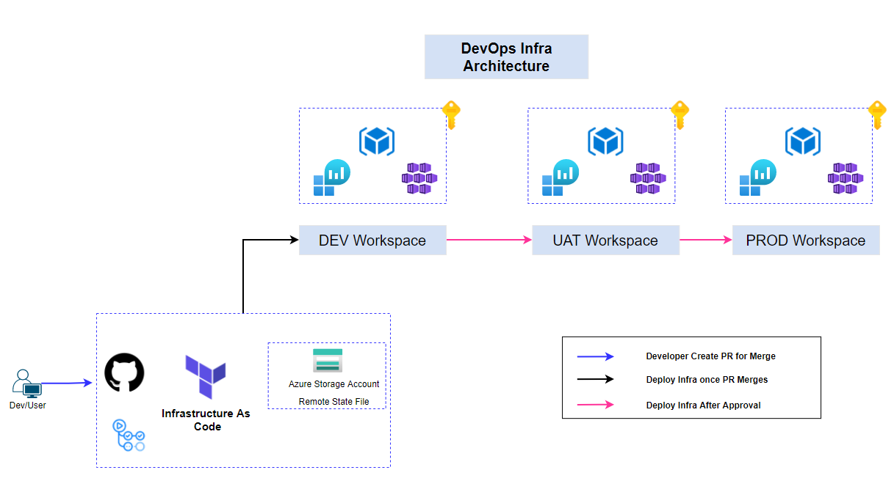
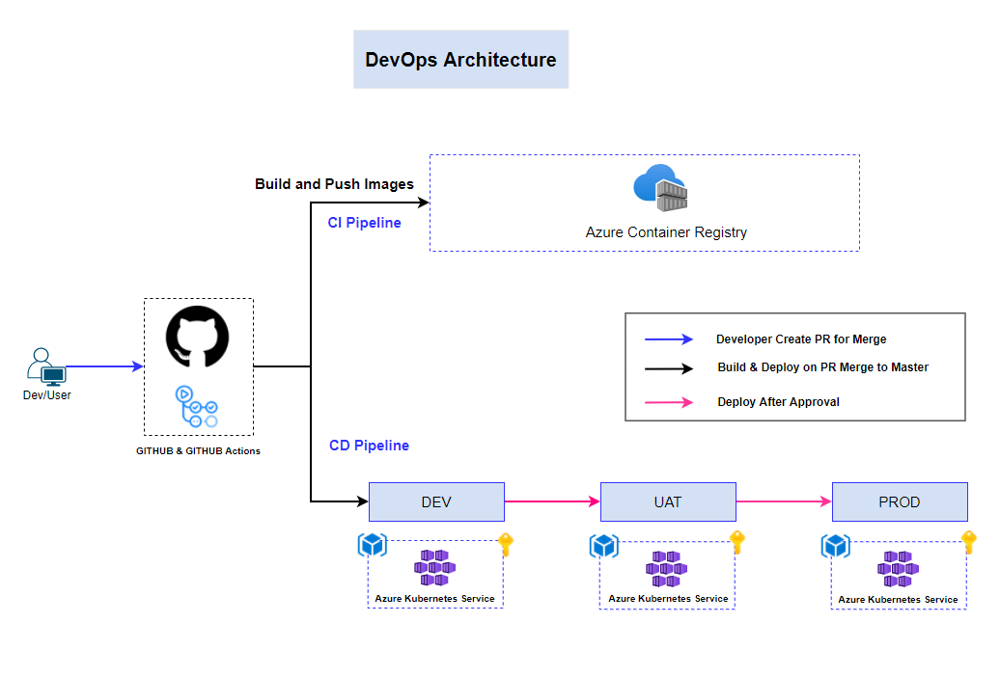

### Introduction
In this section we cover
  - Setting up an infrastructure pipeline.
  - Creating pipelines for multiple environments (e.g., dev, staging, production).

#### Infra pipeline Architecture : Example for reference
In this design you can see multipple environments for infra deployment.



#### Multi Stage Pipeline Architecture : Example for reference
In this design you can see multipple environments for Application deployment.



#### What is Infra Pipeline
    -  It helps set up and manage IT infrastructure (servers, networks, databases, etc.) automatically.

    -  Uses code (like Terraform, Bicep, ARM) to define infrastructure instead of manual setup.

    - Ensures infrastructure updates happen smoothly, just like software updates.

#### How to Setup infra Pipeline

Step 1: First Define Infrstructure Code.

Step 2: Store the Files in Version control like Github, GitLab etc

Step 3: Setup CI/CD to Plan, Apply and Verify Infra Changes.

Step 4: Implement State management

#### What is pipeline for Multiple environment

A Pipeline for Multiple Environments ensures infrastructure is deployed consistently across different stages (Dev, Staging, Prod). 

 Here are three key points:
 1. Environment Segmentation - Seperate Configuration for Dev, Stage, Production
 2. Automated Promotion - Change apply for Dev --> Stage --> Production
 3. State & Access Management - Maintain separate state files and access controls for each environment to prevent unintended changes

 #### How to setup pipeline for Multiple environment

    Set up separate configurations for Dev, Staging, and Production using different stages in your CI/CD pipeline

 ```
 name: Multi-Stage Hello World Pipeline

on:
  push:
    branches:
      - main

jobs:
  dev:
    name: Deploy to Dev
    runs-on: ubuntu-latest
    steps:
      - name: Checkout Code
        uses: actions/checkout@v3

      - name: Hello from Dev
        run: echo "Hello, World from Dev!"

  staging:
    name: Deploy to Staging
    runs-on: ubuntu-latest
    needs: dev  # Runs after Dev stage
    steps:
      - name: Checkout Code
        uses: actions/checkout@v3

      - name: Hello from Staging
        run: echo "Hello, World from Staging!"
    
    # Requires manual approval before running
    environment: 
      name: staging
      url: https://staging.example.com

  production:
    name: Deploy to Production
    runs-on: ubuntu-latest
    needs: staging  # Runs after Staging stage
    steps:
      - name: Checkout Code
        uses: actions/checkout@v3

      - name: Hello from Production
        run: echo "Hello, World from Production!"

    # Requires manual approval before running
    environment: 
      name: production
      url: https://production.example.com
```
