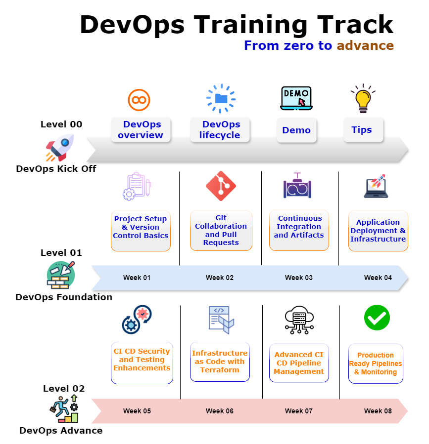

## DevOps Training Plan & Target Completion Date: 10th March 2025

### Level-00: Kickoff Workshop

| Week  | Activity   | Responsible Person | Status |
|--------|------------|--------------------|--------|
| -      | Create Presentation deck with plan for full day workshop | Sumit Raj             | In Review |

### Level-01: DevOps Foundation

| Week  | Activity                                  | Responsible Person | Status |
|--------|------------------------------------------|--------------------|--------|
| Week-01 | Project Setup and Versioning          | Hakeem           | [Status] |
| Week-02 | Git Collaboration and Pull Request       | Hakeem          | [Status] |
| Week-03 | Continuous Integration (CI)              | Saurabh             | [Status] |
| Week-04 | Application Deployment  (CD)           | Promise          | [Status] |

### Level-02: DevOps Advanced

| Week  | Activity                                | Responsible Person | Status |
|--------|----------------------------------------|--------------------|--------|

| Week-05 | CI/CD Security and Testing         | Mohammad al Rousan            | [Completed] |
| Week-06 | Infrastructure as Code             | Mohammad al Rousan             | [Completed |
| Week-07 | Advanced CI/CD Pipelines           | Sumit & Mohammad            | [Completed ] |
| Week-08 | Production-Ready Pipelines         | Saurabh         | [Status] |

## Assessment
### Peer Review Plan < Review the work & Exercise>
-- Review each other <within group>
-- Mentor will be second reviewer
-- Create review group and assign mentor to it.

Needs to be discuss

## Create Feature Branch for each workstream and after review done we can merge to main Branch

Next Improvement Area:
1. Azure Access
2. Azure Connection Limitation 
